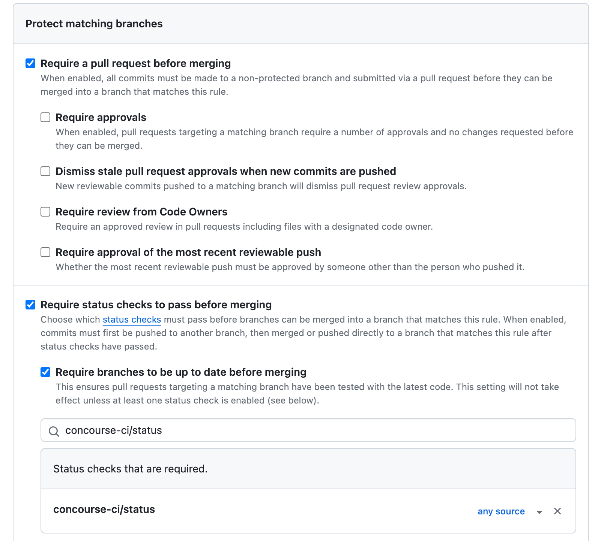

# Sample PHP REST API with Slim Framework

## Stack

-   PHP (see version in composer.json)
-   [Slim Framework](https://www.slimframework.com/)
-   [Composer](https://getcomposer.org/)
-   [Pest Testing Framework](https://pestphp.com/)

CI/CD:

-   [Concourse CI](https://concourse-ci.org/)
-   [Docker Desktop](https://www.docker.com/products/docker-desktop/)

## Getting Started

Install PHP. With macOS [Homebrew](https://brew.sh/):

```shell
brew install php@8.3 # use version in composer.json
```

Install the package manager [composer](https://getcomposer.org/doc/00-intro.md).

Install dependencies:

```shell
composer install
```

To start the web server:

```shell
cd public/
php -S localhost:8888
```

### VSCode

Recommended VSCode extensions:

-   [PHP Intelephense](https://marketplace.visualstudio.com/items?itemName=bmewburn.vscode-intelephense-client)
-   [PHP Namespace Resolver](https://marketplace.visualstudio.com/items?itemName=MehediDracula.php-namespace-resolver)
-   [PHP Debug](https://marketplace.visualstudio.com/items?itemName=xdebug.php-debug)

For CI/CD:

-   [Docker](https://code.visualstudio.com/docs/containers/overview)
-   [Concourse CI Pipeline Editor](https://marketplace.visualstudio.com/items?itemName=vmware.vscode-concourse)

### Using the Debugger in VSCode

Install VSCode's [PHP Debug extension](https://marketplace.visualstudio.com/items?itemName=xdebug.php-debug).

Install [XDebug](https://xdebug.org/docs/install). Be sure to read the "Issues on macOS" and see [this StackOverflow post](https://stackoverflow.com/questions/68944020/why-does-the-installation-of-xdebug-on-my-mac-not-work/73818341#73818341).

Next, find the location of your PHP configuration file:

```shell
php -i | grep ".ini"
```

You can add this below to your "Loaded Configuration File". However, I recommend that you create a new file "xdebug.ini" file inside of the "Scan this dir for additional .ini files" directory.

```ini
zend_extension=xdebug

[xdebug]
xdebug.mode=debug
xdebug.client_host=127.0.0.1
xdebug.client_port=9003
xdebug.start_with_request=yes
```

To confirm that XDebug is configured, either run `php -i` or create a php file with `<?php phpinfo()`. You should see the XDebug is enabled and a checkmark by "Step Debugger". For example:

```
__   __   _      _
\ \ / /  | |    | |
 \ V / __| | ___| |__  _   _  __ _
  > < / _` |/ _ \ '_ \| | | |/ _` |
 / . \ (_| |  __/ |_) | |_| | (_| |
/_/ \_\__,_|\___|_.__/ \__,_|\__, |
                              __/ |
                             |___/

Version => 3.3.1
Support Xdebug on Patreon, GitHub, or as a business: https://xdebug.org/support

             Enabled Features (through 'xdebug.mode' setting)
Feature => Enabled/Disabled
Development Helpers => ✘ disabled
Coverage => ✘ disabled
GC Stats => ✘ disabled
Profiler => ✘ disabled
Step Debugger => ✔ enabled
Tracing => ✘ disabled
```

You can now use the [debugger and breakpoints in VSCode](https://code.visualstudio.com/docs/editor/debugging).

## Tests

This uses [Pest](https://pestphp.com/) for unit and features tests. The Pest framework is built on-top of PHPUnit.

Here is how you can run the tests:

```shell
composer test
```

See the "ExampleTest.php" files for examples on writing tests.

Alternatively, you can launch Pest from the VSCode debugger.

## CI / CD

### Pipeline Outside Resources

#### Github

-   Github repo
-   An SSH key setup on the repo. (See [Generating a new SSH key and adding it to the ssh-agent](https://docs.github.com/en/authentication/connecting-to-github-with-ssh/generating-a-new-ssh-key-and-adding-it-to-the-ssh-agent) and [Adding a new SSH key to your GitHub account](https://docs.github.com/en/authentication/connecting-to-github-with-ssh/adding-a-new-ssh-key-to-your-github-account))
-   A [personal access token](https://docs.github.com/en/authentication/keeping-your-account-and-data-secure/managing-your-personal-access-tokens#creating-a-fine-grained-personal-access-token) with access to the Github repo and these permissions:
    -   Content read-write
    -   Commit status read-write
    -   Pull request read-write
    -   Metadata read-only
-   These at least these restrictions on the dev branch:
    -   Require a pull request before merging
    -   Require status checks to pass before merging
    -   Require branches to be up to date before merging
    -   Status checks required: _concourse-ci/status_



#### AWS

-   IAM:
    -   IAM user group _ConcourseCi_ with _EC2InstanceProfileForImageBuilderECRContainerBuilds_, _AmazonECS_FullAccess_, and _AmazonS3FullAccess_ policies attached
    -   IAM user that belongs to the _ConcourseCi_ group and has an access key
    -   IAM role _ecsTaskExecutionRole_, which was generated by creating a ECS task execution role that has the policies _AmazonECSTaskExecutionRolePolicy_ and _CloudWatchLogsFullAccess_
-   S3 bucket with directory _php-slim_ (to host version file)
-   ECR
    -   ECR private registry called _concourse-php-slim-ci_
    -   ECR private registry called _php-slim_
-   ECS
    -   ECS task definition _php-slim-task-definition_ with AWS Fargate and Linux/X86_64. You can find the rest of the settings within the [task-definition.json file](ci/infra/task-definition.json)
    -   ECS cluster _php-slim_ with AWS Fargate
    -   ECS service _php-slim-service_ with:
        -   Compute options: Launch type
        -   Launch type: FARGATE
        -   Specify _php-slim-task-definition_
        -   Service name _php-slim-service_
        -   Network > Security group: Create a new security group
        -   Security group name: _php-slim-sg_
        -   Inbound rules for security groups: Allow port 80 and 443 for anywhere

### Concourse CI

Before using the pipeline, save _ci/config.yml.example_ as _ci/config.yml_ and plugin the AWS values.

For a tutorial on getting started, see [Concourse CI CD pipeline](https://medium.com/@knoldus/concourse-ci-cd-pipeline-702f46fd7b2a)

To build the pipeline:

```shell
fly -t tutorial set-pipeline -p php-slim -c ci/pipeline.yml -l ci/config.yml
```

To unpause/pause the pipeline:

```shell
fly -t tutorial unpause-pipeline -p php-slim
fly -t tutorial pause-pipeline -p php-slim
```

To destroy the pipeline:

```shell
fly -t example destroy-pipeline -p php-slim
```

Misc examples:

-   https://concourse-ci.org/building-and-pushing-an-image.html
-   https://concourse-ci.org/building-an-image-and-using-it-in-a-task.html
